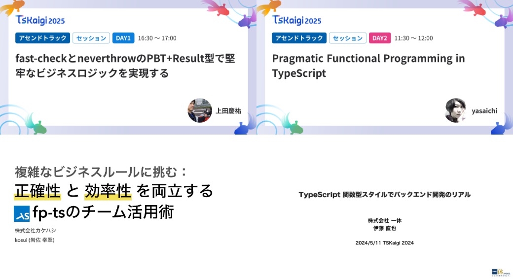

<!-- Proposal

関数型ドメインモデリングの影響もあり、TypeScript で Result 型を使って、失敗する可能性がある関数を明示的に取り扱う方法が普及しつつありますしかし、TypeScript には組み込み型での Result 型は存在しないため、自前で型定義をするか、ライブラリを利用する必要がありますfp-ts、neverthrow, Effect.js といったライブラリと自前での実装の方法について比較しながら解説します
 -->

# Result 型、自前で書くか、ライブラリ使うか

## @TSKaigi2025


---


## 自己紹介

名前：majimaccho
お仕事: @caddi
職種: Web App Engineer

X: @majimaccho\_

---

# TypeScriptのResult型のこと、気になりませんか？

--- 


## 今回と前回のTSKaigiでは…

---



---

# どうしてResult型が必要なの？

--- 

## こんなお困りありませんか？

1. TypeScript で try-catchしたらunknown型になって辛い
2. TSKaigiでResult型がいいらしいけどどのライブラリを使えばいいの？
3. 自前でも実装できそうだけど何がダメかわからない

---

# 結論： ライブラリを使わなくても大丈夫
（使うなとは言ってない）

---

## Result 型 基本の形

```ts
type Result<T, E> = 
| { isOk: true; value: T } 
| { isOk: error: E, message: string };


type CreateHoge = (x: string) => Result<Hoge, HogeError>;
```

try-catchとは違って
- unknownではないのでエラーの型が厳格になる
- エラーを発生させる可能性のある関数を明示的にできる
- エラー処理の抜け漏れを防ぎやすい

---

# ヨシ！

---

# あれ？
# じゃあなんでライブラリがあるの？

---

## 関数型ができない（当たり前）


- Result型は関数型言語での恩恵が大きい
- TypeScriptは関数型言語ではない
- Result型のメソッドチェーンはできない
- エラー合成もできない
- 関数型ドメインモデリングで紹介されているROPはできない

---

## Result 型を実装したライブラリ

これらはメソッドチェーンもエラー合成もできる
- fp-ts
- neverthrow
- Effect

他にもたくさん（迷ったら初手 neverthrow でいいと思う。詳しくはチャッピーに）

```ts
// neverthrow の例

return parse(input)
  .andThen(updateDb)
  .andThen(sendEmail)
  .match(handleSuccess, handleError)
```

---


## ライブラリを使うデメリット

- **オンボーディングコストが高い**
  - 普通のライブラリの学習コストより高い
- **Adapterコードが増える**
  - メソッドチェーンができるようにするために高階関数にする必要が出てくる
  - なれていない人には苦痛を感じさせるかも
- **AIが期待通りにコードを書いてくれない**（らしい）
- **必要な依存が増える**(みなさんZod v4大丈夫ですか)
  - ドメイン層にライブラリは極力入れたくないがResult型が一番欲しいのはドメイン層
---

## 自前での実装

### メリット

- 学習コストが少ない
- 依存が増えない
- メソッドチェーンのためのAdapterはない
- AI が期待通りにコードを書いてくれやすい

### デメリット

メソッドチェーン・エラー合成ができないため
ライブラリを使う場合と比べて、呼び出し側のコードがごちゃっとする

---

## 結論・どちらを使うか：

- チームのライブラリ・関数型プログラミングの習熟度によって異なる
- プロジェクト全体でRailway Oriented Programming をするならライブラリを使うのが良い
- 手続型的に書いている中に Result 型を組み込むのであれば必要な箇所だけ自前で実装するのが良い
- 現環境のAIエージェントでは期待通りにコードを書いてくれないかも

---

## ご清聴ありがとうございました

こちらでもう少し詳しい話をするので、
内容が気になる方はこちらもチェックしてみてください


