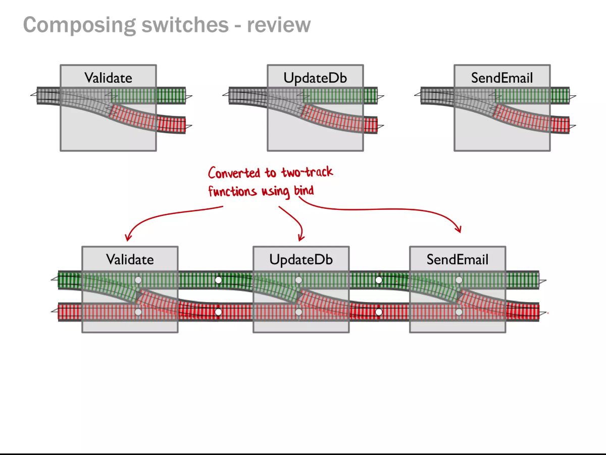

<!-- Proposal

関数型ドメインモデリングの影響もあり、TypeScript で Result 型を使って、失敗する可能性がある関数を明示的に取り扱う方法が普及しつつありますしかし、TypeScript には組み込み型での Result 型は存在しないため、自前で型定義をするか、ライブラリを利用する必要がありますfp-ts、neverthrow, Effect.js といったライブラリと自前での実装の方法について比較しながら解説します
 -->

# Result 型、自前で書くか、ライブラリ使うか

---


## 自己紹介

名前：majimaccho
お仕事: @caddi
職種: Web App Engineer

Twitter（現 X）: @majimaccho\_

---

## こんなお困りありませんか？

1. TypeScript で try-catchしたらunknown型になって辛い
2. TSKaigiでResult型がいいらしいけどどのライブラリを使えばいいの？
3. 自前でも実装できそうだけど何がダメかわからない

---

# 結論：そういう人は自前で十分

---

## 言わずと知れたTypeScript のエラーハンドリング

- try-catchでcatchしたエラーは unknown 型
- try-catch するモデルはどの関数でエラーが起こりうるか暗黙的になりやすい

---

## Result 型 基本の形

```ts
type Result<T, E> = 
| { isOk: true; value: T } 
| { isOk: error: E };

type CreateHoge = (x: string) => Result<Hoge, HogeError>;
```

- 発生させる可能性のあるエラーを明示的にできる
- unknownではないのでエラーの型が厳格になる
- エラー処理の抜け漏れを防ぎやすい

---

# ヨシ！

---

# ほんとに？

---

## Railway Oriented Programmingはできない



- 関数型ドメインモデリングで紹介されている考え方
- Result 型を返す関数をメソッドチェーンで連結していく
- イミュータブルにスッキリ書ける

---

## Result 型を実装したライブラリ

これらはメソッドチェーンもエラー合成もできる
- fp-ts
- neverthrow
- Effect

他にもたくさん（迷ったら初手 neverthrow でいいと思う。詳しくはチャッピーに）

```ts
// neverthrow の例

return parse(input)
  .andThen(updateDb)
  .andThen(sendEmail)
  .match(handleSuccess, handleError)
```

---

## ライブラリを使うメリット

言語仕様にない Result 型の操作を行いやすくしてくれる
これらは自前でやるとかなり面倒くさい

- メソッドチェーン
- エラー合成
- エラーハンドリングの強制力

TypeScript ではこれらをスマートに実現する方法は提供されていない
Railway Oriented Programming をしたければこれらが必要

---

## ライブラリを使うデメリット

それぞれのライブラリに特徴があり、全てに共通するデメリットはないけど、以下のようなもののいずれかがある

- **オンボーディングコストが高い**
  - TypeScriptはオンボーディングコストの低さで選ばれていることも多いはず
  - 普通のライブラリの学習コストよりかなり高い
- **必要な依存が増える**(みなさんZod v4大丈夫ですか)
  - ドメイン層にライブラリを入れることへの抵抗感ありませんか？
- **Adapterコードが増える**
  - ROPの宿命
  - ライブラリのフォーマットに合わせる必要があることもある

---

## 自前での実装

### メリット

- 学習コストが少ない
- 依存が増えない
- 自分たちが使いやすい型にできる
- 自分のプロジェクトに必要なものだけを実装できる
- メソッドチェーンしないためAdapterのコードは少ない

### デメリット

- メソッドチェーン・エラー合成ができないため実装量が増える
- エラーハンドリングの強制力がない

---

## まとめ
| | **学習コスト** | **追加の依存** | **エラーハンドリングの強制力** | **メソッドチェーン** | **エラー合成のしやすさ** |
| --- | --- | --- | --- | --- | --- |
| **自前実装**    | ⭕️ 低い | ⭕️ ない| ❌ ない | ❌ 非対応 | ❌ 愚直に実装 |
| **ライブラリ利用** | ❌ 高い | ❌ ある | ⭕️ 型レベルで強制 | ⭕️ 可能 | ⭕️ 簡潔 |

---

## 結論・どちらを使うか：

- チームのライブラリ・関数型プログラミングの習熟度によって異なる
- プロジェクト全体でRailway Oriented Programming をするならライブラリを使うのが良い
- 手続型的に書いている中に Result 型を組み込むのであれば必要な箇所だけ自前で実装するのが良い
