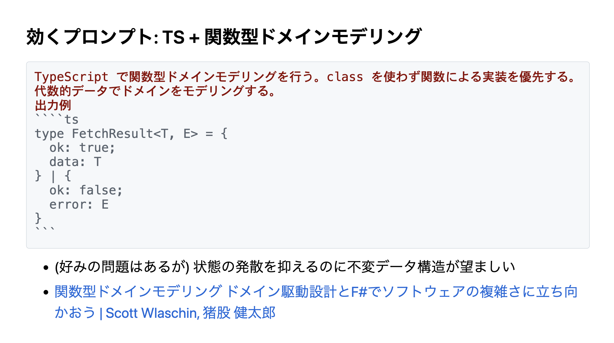
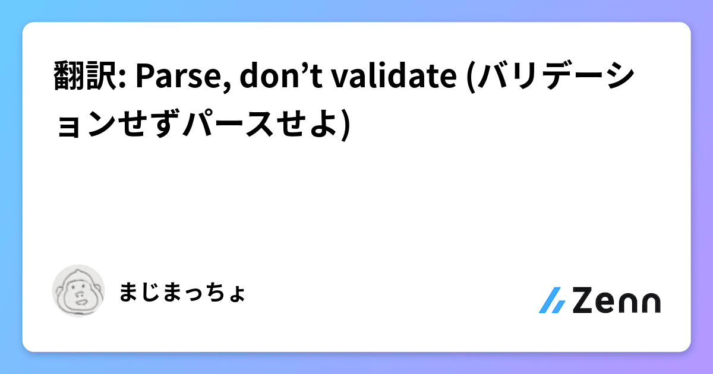
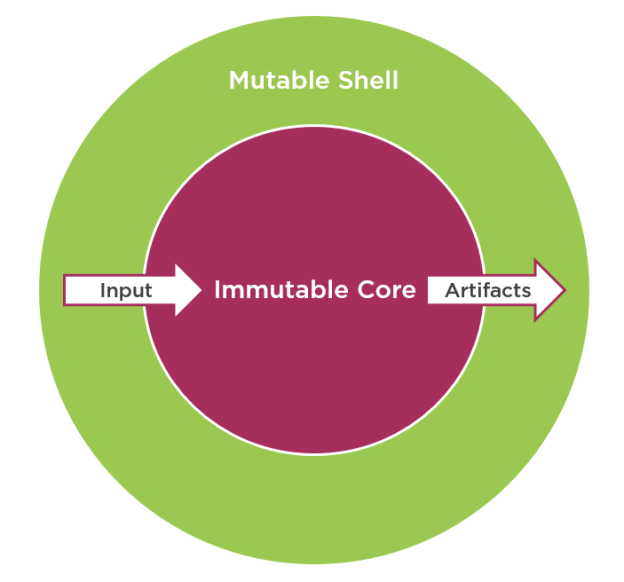

<!-- 近年のTSKaigiでは関数型プログラミングや書籍、関数型ドメインモデリング（原題：Domain Modeling Made Functioan）に関する発表が多くありました。
今回の発表では、具体的な関数型プログラミングの考え方のうち特にTypeScriptのコードを書く上で役立つ3つのアイディアを紹介します。
具体的には以下のアイディアをご紹介します。
Make illegal states unrepresentable（不正な状態を定義できないようにする）
Parse, don’t validate (バリデーションするな、パースせよ)
Dependency Rejection（依存の拒絶）
これらの考え方を取り入れることで、より安全かつ柔軟で理解しやすいTypeScriptのプログラムを書くことができるようになります。 -->

# TypeScript サーバーサイドエンジニアが関数型から学ぶべき 3 つのアイディア

@TSKaigi 2025 After Night

---


## 自己紹介

名前：majimaccho
お仕事: @caddi
職種: Web App Engineer

X: @majimaccho\_

---

# TSKaigi お疲れ様でした！

---


---

# 落選したプロポーザールに書いた

# もっと話したかったことを話します

---

# TSKaigi 2024・2025 に参加して思いました

---


---

# みんな関数型好き〜〜〜（私も好き）

---

# しかし

---

# TypeScript は関数型言語ではありません

---

## TypeScript は関数型言語ではない

⭕️ React をはじめフロントエンドでは関数型言語のプラクティスが取り入れられている
⭕️ 型の表現力の高さは TypeScript の美点で、現代の関数型言語のプラクティスと相性が良い

⚠️ 一方で、現代の関数型言語に当たり前にある機能が TypeScript にはない。そのため、素の TypeScript に関数型言語のプラクティスを全て取り入れることはできない。

---

## 何を取り入れるかのベスプラはまだ定まっていない

そもそも関数型を取り入れること自体が
ベストプラクティスなのかも合意されていないと思われる

---

## 今回は TypeScript の言語仕様に相性が良いものに限って

## 取り入れる価値のあるアイディアを紹介します

---

## TypeScript サーバーサイドエンジニアが関数型から学ぶべき 3 つのアイディア

- Make illegal states unpresentable（不正な状態を定義できないようにする）
- Parse, don’t validate (バリデーションするな、パースせよ)
- Result 型

---

## Make illegal states unrepresentable

### （不正な状態を定義できないようにする）


- 書籍、**関数型ドメインモデリング**で有名になった考え方
- 内部状態の組み合わせを隠蔽しない
- クラスでは**ロジック＋テスト**でこれを表現するが
  関数型のアプローチでは**代数的データ型**で表現する

---

## Make illegal states unrepresentable

連絡先（ContactInfo）はメールアドレスか郵送先の
どちらか、または両方を持つことができる
どちらも持たない状態は許容されないというルールを型で表現する

```ts
type EmailOnlyContactInfo = { type: "EmailOnly"; email: EmailContactInfo };
type PostalOnlyContactInfo = { type: "PostalOnly"; postal: PostalContactInfo };
type EmailAndPostalContactInfo = {
  type: "EmailAndPostal";
  email: EmailContactInfo;
  postal: PostalContactInfo;
};

type ContactInfo =
  | EmailOnlyContactInfo
  | PostalOnlyContactInfo
  | EmailAndPostalContactInfo;
```

---

## Make illegal states unrepresentable は AI に優しい

(mizchi さんの発表から)



---

## 振る舞いについても型で表現する

メールを送信する関数は、メールアドレスが存在する場合にのみ呼び出せる
ContactInfo の変更時にも型で影響の有無が明示される

```ts
const sendEmail = async (
  // PostalOnlyContactInfoは許容しない
  contact: EmailOnlyContactInfo | EmailAndPostalContactInfo
): Promise<EmailSendResult> => {
  // ここでEmailが存在することを型で保証されているので
  // 検証ロジックは不要
};
```

---

# Parse, don’t validate

# (バリデーションするな、パースせよ)

- 外界からの信頼できない入力は可能な限り外側の層で信頼可能な値に Parse する
- Unvalidated（未検証）と Validated（検証済）明確に型レベルで区別する
- Always Valid Domain Model / セキュアバイデザインでも類似した考え方がある
- 不正な状態は存在してはいけないとすることで後続コードは全て入力値の正しさを信じることができる

---

### Parse, don’t validate **ではない**例

```ts
const validateEmail = (emailStr: string): boolean => {
  // 無効なメールアドレスであれば false を返す
  // 有効なメールアドレスであれば true を返す
};

const sendEmail = async (emailStr: string) => {
  if (!validateEmail(emailStr)) {
    throw new InvalidEmailAddressError(emailStr);
  }

  // このままでは EmailService.sendはemailStr が不正な値である可能性がある
  await EmailService.send(emailStr);
};
```

---

### Parse, don’t validate の例

```ts
const parseEmail = (
  unvalidatedEmail: string
):
  | { isOk: true; value: ValidatedEmail }
  | { isOk: false; error: InvalidEmailFormatError } => {
  // 有効なメールアドレスであればtrueではなく
  // { isOk: true, value: ValidatedEmail } を返す
  // 無効なメールアドレスであれば
  // { isOk: false, error: InvalidEmailFormatError } を返す
};

const sendEmail = async (unvalidatedEmail: string) => {
  const parseResult = parseEmail(unvalidatedEmail);

  if (!parseResult.isOk) {
    return parseResult.error;
  }
  // EmailService.sendは引数の値を信用できるため再度検証する必要はない
  await EmailService.send(parseResult.value);
};
```

---

## 宣伝：翻訳したよ



---

## Result 型

- TS の try-catch はエラーを unknown にする
- どの関数が throw するのかインターフェースから理解不能

---

### さっきの Parse, don’t validate の例は Result 型を返している

```ts
const parseEmail = (
  unvalidatedEmail: string
):
| { isOk: true; value: ValidatedEmail }
| { isOk: false; error: InvalidEmailFormatError } => {...};

const sendEmail = async (unvalidatedEmail: string) => {
  const parseResult = parseEmail(unvalidatedEmail);

  if (!parseResult.isOk) {
    return parseResult.error;
  }

  await EmailService.send(parseResult.value);
};
```

---

## 型定義から起こりうるエラーが明示されている

```ts
const parseEmail = (
  unvalidatedEmail: string
):
  | { isOk: true; value: ValidatedEmail }
  | { isOk: false; error: InvalidEmailFormatError } => {
  // 無効なメールアドレスであれば
  // { isOk: false, error: InvalidEmailFormatError } を返す
  // 有効なメールアドレスであれば
  // { isOk: true, value: ValidatedEmail } を返す
};
```

---

## 呼び出し時のエラーハンドリングも改善される

起こりうるエラーが明示的なのでエラー型ごとに個別に対処できる
Result 型

```ts
const sendEmail = async (unvalidatedEmail: string) => {
  const parseResult = parseEmail(unvalidatedEmail);

  if (!parseResult.isOk) {
    // isOkがfalseの場合が起こりうるので処理が必要であることが明示的
    return parseResult.error;
  }

  await EmailService.send(parseResult.value);
};
```

---

## 汎用 Result 型を定義する

```ts
type Result<T, E> =
  | { isOk: true; value: T }
  | { isOk: false; error: E };


// Result 型を使って parseEmail を定義する
const parseEmail = (
  unvalidatedEmail: string
): Result<ValidatedEmail, InvalidEmailFormatError> => {...}

```

---

# ？？？ 「今までのプログラミングと違いすぎて採用できないよ」

---

# それなら段階的に取り入れましょう 😺

---

## 関数型のアイディアの段階的採用

### ドメイン層から始める

- 関数型のアイディアは副作用のない世界ほど恩恵が大きい
- ドメイン層は副作用のあるコードがあるべきではないのでドメイン層から始める



---

## 関数型のアイディアの段階的採用

### Parse, don't validate から始める

- Parse, don't validate 自体は関数型コミュニティでのスローガンだが、コアとなる考え方は Always Valid Domain Model / セキュアバイデザインに近い
- クラス指向的な設計であっても取り入れやすいし部分的にも適用可能
- クラスを使わない表現や Result 型は統一感がないと混乱を招きやすい

---


---

## ご清聴ありがとうございました
